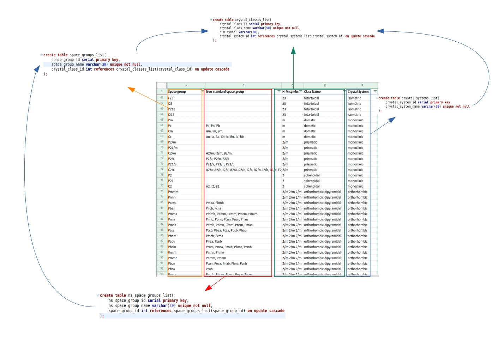
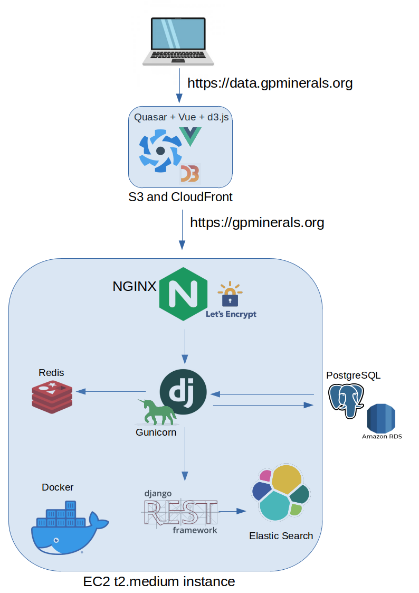

```{r setup, include=FALSE}
knitr::opts_chunk$set(echo = FALSE)
```

## Introduction | A word about myself

- Geological background
  - 2019: PhD in Geology ("Cenozoic mafic dykes of the Argentine Islands (West Antarctica)")
  - 2015: MSc in Geochemistry, Mineralogy and Petrography
  - 2013: BSc in geoinformatics

- Data science related experience: 
  - Since 2017: Freelancer on <a href="upwork.com">Upwork</a>.
  - Since 2018: Data manager/web developer at <a href="https://e-rocks.com">e-Rocks ltd</a>.
  
## Relational mineralogical data model | A cure for geoscientific community?

<h1 class="centered">Model characteristics</h1></br>

  - **Simple** – to be understood by geoscientists
  - **Customizable** – to be responsive to the needs of the researcher
  - **Relational and nested** – the data is organized into separate domains with intra- and cross-domain relations
  - **FAIR** – meet principles of findability, accessibility, interoperability, and reusability
  - **Fast** - find minerals on-the-fly

<h1 class="centered">Processes behind the scenes</h1></br>

  - **Data** (gather, ETL and enrich, validate and migrate to the DB)
  - **Back-end** service to speak nicely with the DB
  - **Front-end** layer to speak nicely with API
  - Model approbation in performing the **data analysis**

## Data

The data warehouse resides in a *postgreSQL* database at **AWS RDS**.

<h1 class="centered">Data gathering</h1></br>

The data comes in raw format from at least 3 different sources:

  - the existing mineralogical resources (eg <a href="http://rruff.geo.arizona.edu/AMS/amcsd.php">AMCSD</a>, 
  <a href="rruff.info/evolution">MED</a>, <a href="https://rruff.info/ima/">IMA list</a> etc)
  - web scraping open-source resources using *node.js* and *puppeteer.js*
  - hard-copy/online publications (<a href="http://www.minsocam.org/msa/ammin/ammineral.html">American Mineralogist</a>, <a href="https://pubs.geoscienceworld.org/canmin">Canadian Mineralogist</a> etc)
  
## Data ETL and enrich | <a href="https://github.com/liubomyrgavryliv/database-export">https://github.com/liubomyrgavryliv/database-export</a>

Initially, the data is loaded to *RStudio* and tested through next set of rules to make sure it meets the requirements of data warehouse:

  - join with **master table** of mineral species through mineral names key 
    - create 'anti-join' subset for double check
  - check duplicates
  - aggregate data - check unique values
  - clean data
    - remove trailing spaces
  - normalize data
    - transposing or pivoting (turning multiple columns into multiple rows or vice versa)
    - splitting a column into multiple columns (split strings into a list => explode a list into individual values in different columns)
  - join **master tables**, replace values with IDs from master tables
  
## Data validation, update/insert/delete on the DB side | <a href="https://github.com/liubomyrgavryliv/database-dev">https://github.com/liubomyrgavryliv/database-dev</a>

*Python* scripts to keep the DB synched and upload new batches of validated data. 
  
  - functions to generate import tables
  - *validator* class
    - cross-check new batch of data with **master tables** in the DB
    - record validation errors
    - create "pretty" validation report which is sent to a mineralogist for a review
  - *updater* class
    - decide which event should occur depending on table type (if main minerals table -> UPDATE/INSERT/DELETE, if many-to-many -> INSERT and/or DELETE)
    - record update events

## Example of data ETL to DB | Upload of crystallography master tables
```{r out.width = "75%", fig.align = "center"}

```

## Back-end | <a href="https://github.com/liubomyrgavryliv/gpminerals">https://github.com/liubomyrgavryliv/gpminerals</a>

The back-end consists of 4 *services*:

  - Django app running behind the HTTPS NGINX proxy with Let's Encrypt SSL certificates
  - NGINX server 
  - Redis database for caching the API requests
  - NoSQL database for seamless and fast searching (Elastic Search)
  - plans: 
    - add Celery for async tasks handling
    - add CI/CD
  
All of this is dockerized and deployed to AWS EC2 instance at <a href="https://gpminerals.org">gpminerals.org</a>.

## Back-end architecture
<center>
{width=40%}
</center>
  
## Front-end | <a href="https://github.com/liubomyrgavryliv/gpminerals-vue">https://github.com/liubomyrgavryliv/gpminerals-vue</a>

Currently, the front-end contains several pieces, which are going to be stitched together soon:

  - Main page, deployed as a PWA to <a href="https://data.gpminerals.org">https://data.gpminerals.org</a> (Quasar, Vue.js, AWS S3)
  - d3.js interactive visualizations 
  
## The Search engine using Elastic Search (NoSQL) and Quasar
<iframe width="180" height="400" src="https://data.gpminerals.org" scrolling="yes" frameborder="0" allowfullscreen></iframe>

## Mineralogical Nickel-Strunz classification | d3.js <a href="https://liubomyrgavryliv.github.io/d3-NS-sunburst-webpack/">https://liubomyrgavryliv.github.io/d3-NS-sunburst-webpack/</a>

<iframe width="180" height="400" src="https://liubomyrgavryliv.github.io/d3-NS-sunburst-webpack/" scrolling="yes" frameborder="0" allowfullscreen></iframe>

## Mineralogical Groups classification | d3.js <a href="https://liubomyrgavryliv.github.io/d3-NS-groups-visualization/">https://liubomyrgavryliv.github.io/d3-NS-groups-visualization/</a>

<iframe width="180" height="400" src="https://liubomyrgavryliv.github.io/d3-NS-groups-visualization/" scrolling="yes" frameborder="0" allowfullscreen></iframe>


## Model approbation

American Mineralogist has accepted our research paper on **"Analysis and visualization of the evolution of mineral discoveries, their distribution and naming process"**
<a href="http://www.minsocam.org/MSA/Ammin/AM_Preprints.html">Papers in Press</a>

The paper goes into the data analysis of Nickel-Strunz classes, name origins of minerals, country, and time of their discovery to enrich
our knowledge of the evolution of mineral discoveries, their spatial distribution, and naming tendencies during different periods.

{width=50%} {width=47%}


The dashboard, developed within the course of the paper using Python Dash, deployed to Heroku <a href="https://names-dashboard.herokuapp.com/">https://names-dashboard.herokuapp.com/</a>


## Thank you for attention :)

